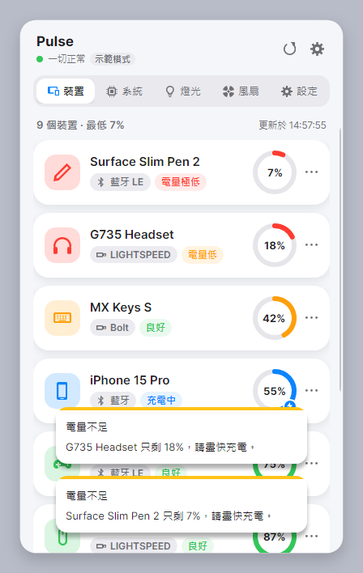
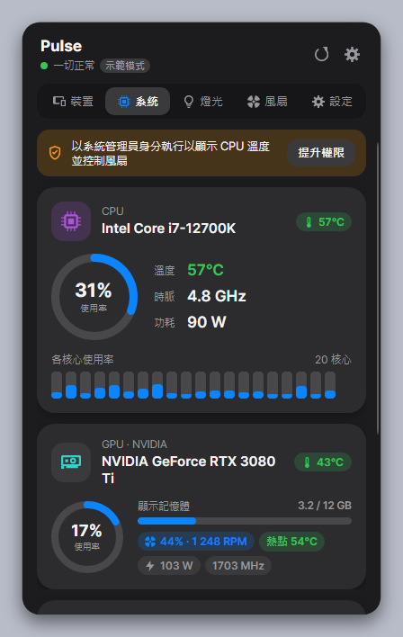
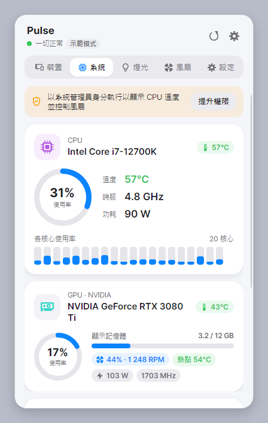
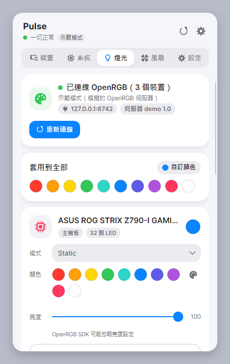
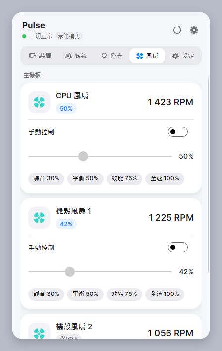
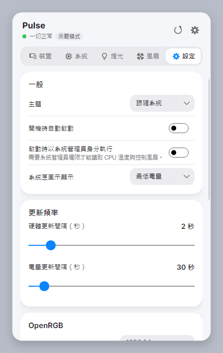
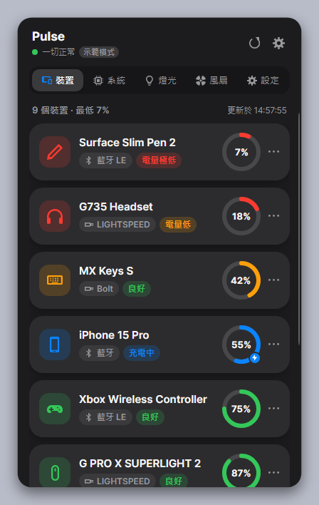
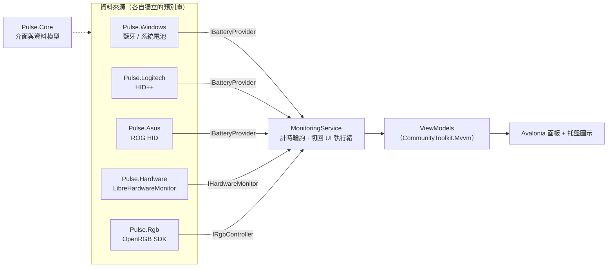

# Pulse

> A clean, Apple / Logitech Options+–style **system tray app** that shows the **battery level of every connected device** (Bluetooth, Logitech HID++, ASUS ROG), **CPU / GPU load & temperature**, lets you **control fan speeds** and **RGB lighting** (via OpenRGB). Built with .NET 9 + Avalonia. Windows first; macOS / Linux planned.

常駐在系統托盤的小工具，點一下就能看到：所有無線裝置的剩餘電量、CPU / GPU 使用率與溫度、風扇轉速（可手動控制），並控制電腦裡的 RGB 燈光。介面參考 Apple 與 Logitech Options+：圓角卡片、明亮色彩、淺色 / 深色主題自動切換，全部繁體中文。

<p align="center">
  
  
</p>

---

## 目錄

- [功能](#功能)
- [介面](#介面)
- [安裝與執行](#安裝與執行)
- [技術原理](#技術原理)
  - [整體架構](#整體架構)
  - [藍牙裝置電量](#1-藍牙裝置電量windows)
  - [Logitech HID++ 電量](#2-logitech-hid-電量)
  - [ASUS ROG 周邊電量](#3-asus-rog-周邊電量)
  - [CPU / GPU / 風扇](#4-cpu--gpu--風扇librehardwaremonitor)
  - [RGB 燈光](#5-rgb-燈光openrgb-sdk)
  - [托盤與介面](#6-托盤與介面avalonia)
- [專案結構](#專案結構)
- [已知限制](#已知限制)
- [規劃](#規劃)
- [授權](#授權)

---

## 功能

| 分頁 | 內容 |
|---|---|
| **裝置** | 所有回報電量的裝置：藍牙 / 藍牙 LE、Logitech（Unifying、LIGHTSPEED、Bolt 接收器與 USB / 藍牙直連）、ASUS ROG 無線鍵盤 / 滑鼠、筆電內建電池。顯示電量環、連線方式、狀態（充電中 / 電量低 / 休眠中 / 未連線）。低電量時跳出提醒 |
| **系統** | CPU 使用率（含每個邏輯核心）、Package 溫度、時脈、功耗；每張 GPU 的使用率、核心 / 熱點溫度、VRAM、風扇、功耗、時脈；記憶體；主機板其他溫度 |
| **燈光** | 透過 OpenRGB 控制主機板、記憶體、顯示卡、鍵鼠等 RGB：一鍵全部套色、每個裝置的模式 / 顏色 / 速度 / 分區顏色 |
| **風扇** | 依主機板 / 顯示卡分組列出風扇轉速；可控制的風扇提供手動模式、滑桿與「靜音 / 平衡 / 效能 / 全速」預設，關閉手動即交回自動曲線 |
| **設定** | 主題、開機自動啟動、啟動時自動提權、托盤圖示顯示內容、更新頻率、OpenRGB 主機 / 連接埠、低電量提醒門檻 |

托盤圖示本身也是即時資訊：預設顯示**最低的裝置電量**（顏色依電量變化），也可改為 CPU 溫度、GPU 溫度或 CPU 使用率；滑鼠停在圖示上會列出所有裝置與 CPU / GPU 摘要。

## 介面

點托盤圖示會在螢幕右下角彈出 400 × 660 的圓角面板，點其他地方或按 Esc 自動收起。

<table>
  <tr>
    <th>裝置</th><th>系統</th><th>燈光</th>
  </tr>
  <tr>
    <td></td>
    <td></td>
    <td></td>
  </tr>
  <tr>
    <th>風扇</th><th>設定</th><th>深色主題</th>
  </tr>
  <tr>
    <td></td>
    <td></td>
    <td></td>
  </tr>
</table>

> 截圖為 `--demo` 示範資料。`docs/screenshots/` 另有每個分頁的深色版與完整捲動高度（`-full`）版本。

設計重點：

- **卡片**：20 px 圓角、16 px 內距、柔和陰影；淺色背景 `#F5F6FA`、深色 `#1C1C1E`。
- **色彩語意**：藍 `#0A84FF`（主色 / 充電）、綠 `#34C759`（良好 / <60 °C）、橘 `#FF9F0A`（注意 / 20–49 % / 60–79 °C）、紅 `#FF3B30`（危險 / <20 % / ≥80 °C）。
- **元件**：自繪電量環（`RingGauge`）、膠囊標籤（`StatPill`）、分段式分頁切換、圓角滑桿與開關。
- 所有顏色都是主題資源（`ThemeDictionaries`），淺色 / 深色即時切換。

## 安裝與執行

### 需求

| 項目 | 說明 |
|---|---|
| 作業系統 | Windows 10 1809+ / Windows 11 |
| 執行階段 | [.NET 9 SDK](https://dotnet.microsoft.com/download/dotnet/9.0)（建置）或 .NET 9 Desktop Runtime（只執行） |
| CPU 溫度 / 主機板風扇 | **以系統管理員身分執行**，並安裝 [PawnIO](https://pawnio.eu) 核心驅動 |
| RGB 燈光 | 安裝 [OpenRGB](https://openrgb.org/releases.html)，在「設定 › SDK Server」啟用（或以 `OpenRGB.exe --server --startminimized` 啟動） |
| Logitech / ASUS 電量 | 透過接收器或 USB 連接即可，可與 G HUB 同時執行 |

### 執行

```powershell
git clone https://github.com/alextixu/pulse-monitor.git
cd pulse-monitor

.\run.ps1          # 一般權限：電量、GPU、燈光
.\run-admin.ps1    # 系統管理員：再加上 CPU 溫度與風扇控制（會跳 UAC）
.\run.ps1 -Demo    # 示範模式：假資料，不碰硬體
```

或 `dotnet run --project src\Pulse.App`。

| 參數 | 功能 |
|---|---|
| `--minimized` | 啟動後只顯示托盤圖示（開機自動啟動使用） |
| `--demo` | 使用示範資料 |
| `--screenshot <資料夾>` | 把五個分頁（淺色 + 深色）輸出成 PNG 後結束 |

發行成單一資料夾：

```powershell
dotnet publish src\Pulse.App -c Release -r win-x64 --self-contained false -o publish\win-x64
```

設定檔在 `%APPDATA%\Pulse\settings.json`，記錄檔在 `%LOCALAPPDATA%\Pulse\logs\app.log`。

---

## 技術原理

### 整體架構



- **`Pulse.Core`** 只定義契約：`IBatteryProvider`（回傳 `BatteryDevice` 清單）、`IHardwareMonitor`（`HardwareSnapshot` + `SetFanAsync`）、`IRgbController`，以及設定、提權、開機啟動等平台服務。UI 完全不知道資料從哪來。
- 每個資料來源是獨立類別庫，透過 `AddXxx()` 擴充方法註冊到 DI；非 Windows 平台或缺少的服務自動以 `Null*` 實作補上，所以介面在任何平台都能啟動。
- **`MonitoringService`** 以兩個 `PeriodicTimer` 分別輪詢電量（預設 30 秒，面板打開時立即刷新）與硬體（預設 2 秒）。所有 provider 都在執行緒集區執行、各自錯誤隔離（一個 provider 失敗不影響其他），結果再以 `Dispatcher.UIThread.Post` 切回 UI 執行緒發佈。
- `--demo` 會把所有 provider 換成假資料實作，用來開發介面與產生截圖。

### 1. 藍牙裝置電量（Windows）

Windows 的藍牙堆疊會讀取裝置的電量（BLE 的 GATT Battery Service、經典藍牙的 HFP 電量回報），並快取在裝置節點的屬性 **`DEVPKEY_Bluetooth_Battery`**（`{104EA319-6EE2-4701-BD47-8DDBF425BBE5} 2`，1 byte 百分比）。設定 › 藍牙頁面顯示的電量就是這個值。

1. 用 WinRT `DeviceInformation.FindAllAsync` 搭配 `BluetoothDevice` / `BluetoothLEDevice.GetDeviceSelectorFromPairingState(true)` 列出已配對裝置，同時取得 `System.Devices.Aep.IsConnected`、位址、BLE Appearance 與經典藍牙 Class of Device。
2. 用 `PnpObject.FindAllAsync` 加上 AQS 篩選 `System.Devices.DeviceInstanceId:~<"BTH"`（只掃 `BTHENUM` / `BTHLE` 節點，掃描從約 500 個節點 / 659 ms 降到 14 個 / 9 ms）讀取電量屬性。
3. 以 12 位數藍牙位址把兩邊對起來；裝置類型依 BLE Appearance → Class of Device → 名稱關鍵字推斷。

不主動連線讀 GATT，所以不會干擾裝置原本的驅動程式；代價是只拿得到 Windows 有快取的電量。

### 2. Logitech HID++ 電量

Logitech 的無線接收器與裝置使用 **HID++** 協定（與 Solaar、logiops 相同），透過廠商自訂 HID 集合（usage page `0xFF00`）交換報告：

- 短報告 `0x10`（7 bytes）、長報告 `0x11`（20 bytes）。Windows 會把每個 top-level collection 拆成獨立的 HID 裝置，所以要同時開啟同一介面的短、長兩個集合，在背景執行緒讀取並依（裝置索引、feature index、software id）配對回覆。
- **探測**：對索引 `0xFF` 送 Root feature 的 ping。回 HID++ 2.0 版本號代表是直連裝置；回 HID++ 1.0 錯誤（`0x8F`）代表是接收器，再讀接收器暫存器 `0xB5` 取得每個配對槽（1–6）的裝置名稱、類型、序號。
- **Feature 探索**：HID++ 2.0 的功能是動態索引的，先以 Root `getFeature(featureId)` 查出 `DEVICE_NAME (0x0005)`、`DEVICE_FW_VERSION (0x0003)`、電量功能的索引並快取。
- **電量**：依序嘗試 `UNIFIED_BATTERY (0x1004)`（百分比 + 充電狀態）、`BATTERY_STATUS (0x1000)`、`BATTERY_VOLTAGE (0x1001)`（電壓查表換算百分比）；HID++ 1.0 裝置用暫存器 `0x0D` / `0x07`。
- 休眠的裝置會讓接收器立刻回錯誤碼 `0x09`，因此列為「休眠中」並保留最後電量，不會等待逾時。首次探索約 130 ms，之後每次輪詢只需 1–8 ms。

### 3. ASUS ROG 周邊電量

ROG 無線鍵盤（如 Falchion）的 2.4 GHz 接收器會提供一個廠商 HID 集合（usage page `0xFF00`，64 bytes、無 report ID），使用與 OpenRGB「TUF 鍵盤」相同的指令框架：寫入 `[cmd, sub, 0…]`，回覆前兩個 byte 會回傳相同的 `cmd, sub`，被拒絕時則回 `FF AA`。

| 指令 | 用途 | 回覆 |
|---|---|---|
| `12 00` | 韌體版本（同時用來判斷裝置是否支援此協定） | 例如 `12 00 00 00 01 00 03 …` → 3.00.01 |
| `12 01` | 鍵盤狀態 | **byte 10 = 電量百分比**，byte 11–12 疑似電池電壓（mV，小端序） |
| `12 07` | ROG 滑鼠電量（依 rogdrv 實作，尚未實機驗證） | byte 4 = 百分比 |

`12 01` 的電量位置是在實機上比對鍵盤自身的電量顯示（約 100 %）找出來的。為了安全，只會對產品名稱含 ROG / TUF 的裝置送出唯讀的 `12 xx` 查詢，並明確排除主機板的 AURA 燈控（例如 `0B05:19AF`）。不支援此協定的裝置會在 2 分鐘內不再詢問。

### 4. CPU / GPU / 風扇（LibreHardwareMonitor）

使用 [LibreHardwareMonitorLib](https://github.com/LibreHardwareMonitor/LibreHardwareMonitor)：

- **CPU 溫度**需讀取 MSR 暫存器（例如 Intel 的 `IA32_PACKAGE_THERM_STATUS`），**主機板風扇**需存取 Super I/O 晶片（例如 Nuvoton NCT67xx）的 I/O port，兩者都需要核心驅動。LHM 0.9.6 使用 **PawnIO**（舊的 WinRing0 在 Windows「記憶體完整性」開啟時會被封鎖），而且程式必須以系統管理員身分執行。
- **GPU** 走廠商 API（NVIDIA NVAPI / NVML、AMD ADL），不需要管理員權限，數值與 `nvidia-smi` 一致。
- 每次快照以 `IVisitor` 走訪整棵感測器樹並呼叫 `Update()`，一次走訪就組出 `HardwareSnapshot`（約 120 ms）。Alder Lake 的 P-core / E-core 與 `Core #n Thread #m` 命名都有處理。
- **風扇控制**：把 `SensorType.Fan`（轉速）與同一硬體上相同索引的 `SensorType.Control`（PWM 工作週期）配對，再透過 `IControl.SetSoftware(%)` 設定轉速、`SetDefault()` 交回韌體曲線。數值會限制在硬體回報的範圍內（例如 NVIDIA 最低 30 %）。程式結束時會還原所有被改過的風扇。
- 所有 LHM 呼叫都用同一把鎖序列化，因為 LHM 不是執行緒安全的。

未以管理員執行時，狀態會顯示為「降級」，並在介面上提供「以系統管理員身分重新啟動」（`ShellExecute` + `runas`，帶 `--elevated-relaunch` 參數避免重複提權）。

### 5. RGB 燈光（OpenRGB SDK）

各家 RGB 協定差異很大，所以 Pulse 不自己實作驅動，而是透過 [OpenRGB](https://openrgb.org) 的 **SDK Server**（TCP `127.0.0.1:6742`）控制所有 OpenRGB 支援的裝置：

- 每個封包是 16 bytes 標頭（`"ORGB"` magic、device id、packet id、資料長度）加上資料。主要使用 `REQUEST_CONTROLLER_COUNT (0)`、`REQUEST_CONTROLLER_DATA (1)`、`UPDATELEDS (1050)`、`UPDATEZONELEDS (1051)`、`UPDATEMODE (1101)`，並與伺服器協商使用 protocol v4。
- **設定單一顏色**：裝置有 `Direct` 模式時切換到 Direct 再寫入每顆 LED；否則使用帶顏色參數的 `Static` 模式。
- 用戶端是 [OpenRGB.NET](https://github.com/diogotr7/OpenRGB.NET) 3.1.1。實測發現 OpenRGB 關閉後，這個函式庫的 `Connected` 屬性仍會維持 `true`，而且讀取迴圈會讓一個 CPU 核心空轉到 100 %。所以 Pulse 會每 2 秒以及每次呼叫前直接檢查底層 socket（`OpenRgbClientProbe`），一旦發現斷線就丟棄用戶端並在介面上提示。
- 每個操作都有逾時與取消機制，並以 `SemaphoreSlim` 序列化；連不上時面板會顯示安裝與啟用 SDK Server 的步驟。

### 6. 托盤與介面（Avalonia）

- **UI 框架**：[Avalonia 11](https://avaloniaui.net)（跨平台 XAML），搭配 Fluent 主題，MVVM 使用 CommunityToolkit.Mvvm 的 source generator（`[ObservableProperty]`、`[RelayCommand]`），並開啟 compiled bindings。
- **托盤圖示**：以 SkiaSharp 在記憶體中繪製 32 × 32 圖示（彩色圓環加上數字，或電池圖示），編碼成 PNG 後交給 Avalonia 的 `TrayIcon`，因此不需要任何視窗也能更新。
- **彈出面板**：無邊框、透明背景、永遠置頂的視窗。依螢幕工作區（扣除工作列）與 DPI 縮放計算位置，固定在右下角並保留 12 px 邊距；失去焦點時隱藏而不是關閉，所以再次開啟是即時的。
- **單一執行個體**：使用具名 Mutex（`Global\Pulse.SingleInstance`）。第二個執行個體會透過具名 `EventWaitHandle` 通知第一個執行個體打開面板，然後自行結束。
- **截圖模式**：`--screenshot` 會用 `RenderTargetBitmap` 逐一渲染每個分頁的淺色 / 深色版本，用來在沒有人操作的情況下驗證介面。

---

## 專案結構

```
src/
  Pulse.Core/      介面與資料模型：IBatteryProvider、IHardwareMonitor、IRgbController、AppSettings
  Pulse.Windows/   藍牙電量（WinRT + DEVPKEY_Bluetooth_Battery）、系統電池、UAC 提權、開機啟動（HKCU\…\Run）
  Pulse.Logitech/  HID++ 1.0 / 2.0 電量（HidSharp）
  Pulse.Asus/      ASUS ROG / TUF 周邊電量（HidSharp）
  Pulse.Hardware/  LibreHardwareMonitor：CPU / GPU / 記憶體 / 風扇與風扇控制
  Pulse.Rgb/       OpenRGB SDK 用戶端與斷線偵測
  Pulse.App/       Avalonia 托盤應用
    Views/         彈出面板與五個分頁
    ViewModels/    MVVM
    Services/      MonitoringService、托盤、設定、記錄、截圖
    Controls/      RingGauge、StatPill
    Styles/        主題色彩、控制項樣式、圖示（StreamGeometry）
    Demo/          示範資料
docs/screenshots/  介面截圖
run.ps1 / run-admin.ps1
```

## 已知限制

- Windows 對藍牙裝置只提供電量百分比，沒有充電狀態；不回報電量的裝置（例如 A2DP 音響）只會顯示名稱。
- ASUS ROG：Falchion（2.4 GHz）已經實機驗證；其他 ROG 鍵盤 / 滑鼠屬於盡力支援，因為各型號的電量位置可能不同。
- OpenRGB.NET 3.1.1 無法設定「亮度」，介面上已標示。
- 手動風扇設定只持續到程式結束，也無法偵測其他軟體（Armoury Crate、Afterburner）設定的值。
- 低電量提醒顯示在面板內，不是 Windows 系統通知。
- macOS / Linux：介面與核心可以編譯，但硬體監控與藍牙電量的 provider 尚未實作。

## 規劃

1. macOS：選單列、IOKit 電量、SMC 溫度 / 風扇。
2. Linux：`/sys/class/power_supply`、UPower、hwmon。
3. Windows **Dynamic Lighting（HID LampArray）** 後端：不需 OpenRGB 就能控制支援的鍵鼠燈光。
4. Logitech HID++ 直接燈光控制（`0x8070` / `0x8071`）。
5. 單元測試與 CI。

## 授權

[MIT](LICENSE)

使用的開源專案：[Avalonia](https://github.com/AvaloniaUI/Avalonia)、[LibreHardwareMonitor](https://github.com/LibreHardwareMonitor/LibreHardwareMonitor)、[HidSharp](https://www.zer7.com/software/hidsharp)、[OpenRGB.NET](https://github.com/diogotr7/OpenRGB.NET)、[CommunityToolkit.Mvvm](https://github.com/CommunityToolkit/dotnet)。HID++ 協定的細節參考自 [Solaar](https://github.com/pwr-Solaar/Solaar)，ASUS 協定參考自 [OpenRGB](https://gitlab.com/CalcProgrammer1/OpenRGB)。
